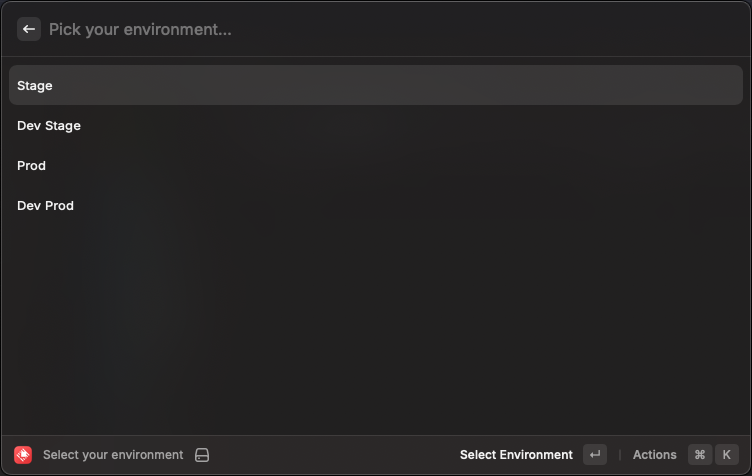
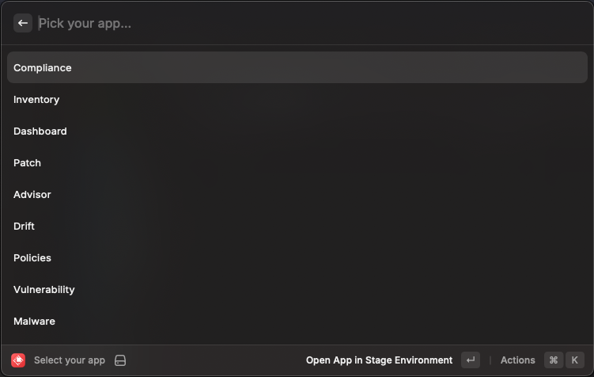

# Consoledot
Quickly open a Console Dot app in your selected environment.

Requires [Raycast](https://www.raycast.com/)

1. First select your environment

2. Then select your app

## How to install

1. Clone the repo
2. In Raycast use the "Import extension" command.
3. `npm install && npm run build`
4. Extension should work now
